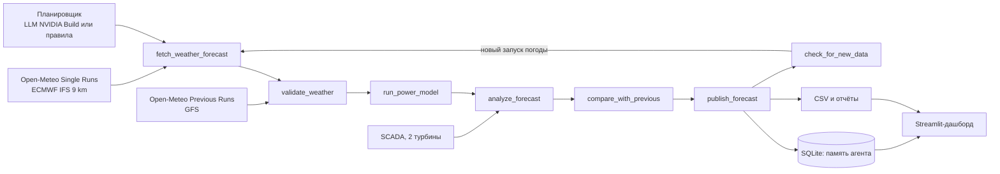

# Ветровой агент: Agentic AI для прогноза выработки ВЭС

Команда **Low Prior-IT**, HackAlem AI, кейс Самрук-Казына «Agentic AI для прогнозирования выработки ВЭС».

Агент каждый день в 12:00 по времени Астаны сам забирает свежий архивный прогноз погоды ECMWF по координатам турбин, проверяет его качество, прогоняет модель выработки и публикует почасовой вероятностный прогноз мощности ВЭС на следующие двое суток. Когда выходит новый запуск погодной модели, агент пересчитывает прогноз и публикует обновление, только если оно существенно меняет картину для диспетчера.

## Что делает проект

Проект воспроизводит работу прогнозиста ВЭС в прошлом, день за днём. Для каждого дня тестового периода (выпуски с 31.01.2026 по 27.02.2026) агент видит только то, что было доступно в тот момент: запуски погодной модели, уже опубликованные к 12:00, и факты SCADA до этого момента. На выходе почасовой прогноз нормализованной мощности (доля номинала) по каждой турбине и по ВЭС в целом на сутки D+1 и D+2, с интервалом неопределённости P10-P90 и текстовым выводом для диспетчера.

## Какую проблему решает и для кого

Пользователь - диспетчер ВЭС или специалист, который подаёт заявку на выработку на следующие сутки. Ветер меняется быстро, и ошибка прогноза оборачивается штрафами за небаланс и неэффективной загрузкой резервов. Сейчас такой прогноз часто делают вручную по одному погодному сайту. Агент закрывает весь цикл автоматически: погода, проверка данных, модель, анализ рисков (шторм, обледенение, резкие рампы), публикация и пересчёт при обновлении погоды, а каждое решение записывается в журнал, чтобы человек мог проверить, почему прогноз именно такой.

## Что реализовано

| Требование кейса | Как реализовано | Где в коде |
|---|---|---|
| Модель почасовой выработки по историческим данным | Эмпирическая кривая мощности + MOS-коррекция ветра + LightGBM (квантили P10/P50/P90) на 690 архивных запусках ECMWF | `windagent/model.py`, `windagent/features.py` |
| Погода из открытых источников по координатам | Open-Meteo Single Runs API (ECMWF IFS HRES 9 km) и Previous Runs API (GFS, ICON), без ключа | `windagent/openmeteo.py`, `windagent/weather.py` |
| Прогноз на 24-48 часов почасово | 48 значений: сутки D+1 и D+2 по каждой турбине и по ВЭС | `windagent/tools.py` |
| Agentic AI, полный цикл | Агент с 9 инструментами: получение погоды, проверка, модель, анализ, сравнение, публикация, проверка обновлений. Планировщик: LLM через NVIDIA Build или детерминированные правила | `windagent/agent.py`, `windagent/tools.py` |
| Архивные прогнозы на момент прогноза, без будущих данных | Часы агента: инструмент отказывает, если запуск погоды ещё не был опубликован (`TimeTravelError`); факты SCADA только до текущего момента | `windagent/tools.py`, `tests/test_pipeline.py` |
| Повторный расчёт при обновлении данных | Через 6 часов после выпуска агент проверяет новый запуск ECMWF, пересчитывает и публикует обновление, если изменение существенно | `check_for_new_data` в `windagent/tools.py` |

## Основной сценарий: от входных данных до результата

Один цикл прогноза на день D выглядит так. В 07:00 UTC (12:00 Астаны) агент вызывает `get_situation` и узнаёт целевое окно (сутки D+1 и D+2 по шкале SCADA) и самый свежий опубликованный запуск погоды, это запуск 00 UTC дня D. Затем `fetch_weather_forecast` получает этот запуск по координатам обеих турбин, а `validate_weather` проверяет покрытие окна, физические диапазоны, согласованность с предыдущим запуском ECMWF и с независимой моделью GFS. Если проверка провалена, агент берёт предыдущий запуск, а если погоды нет совсем, делает резервный прогноз по климатологии.

Дальше `run_power_model` строит признаки и выдаёт квантили P10/P50/P90, а `analyze_forecast` ищет риски: высокую неопределённость, расхождение ML и физической модели, резкие рампы, ветер выше 20 м/с (штормовое отключение), условия обледенения, отклонение от климатической нормы, систематический сдвиг последних прогнозов на известных фактах. Публикация без анализа запрещена. `compare_with_previous` сравнивает новую версию с последним опубликованным прогнозом на те же часы, после чего `publish_forecast` записывает CSV, JSON-отчёт и вывод для диспетчера. В 13:00 UTC агент вызывает `check_for_new_data`: вышел запуск 06 UTC, агент повторяет получение, проверку и расчёт и публикует обновление только при заметном изменении.

Все вызовы инструментов, аргументы, результаты и решения пишутся в SQLite (`agent_memory.sqlite`), дашборд показывает их по каждому дню.



## Архитектура

Проект разделён на слои. Слой данных (`scada.py`, `openmeteo.py`, `weather.py`) загружает SCADA, чистит простои и зависания датчика, агрегирует по часам и получает погоду с кэшированием каждого ответа API. Слой модели (`features.py`, `model.py`) строит физические признаки (ветер на высоте ступицы после MOS, плотность воздуха, сдвиг ветра, порывистость, ожидаемая мощность с учётом неопределённости ветра) и обучает четыре бустинга LightGBM: среднее и квантили 0.1, 0.5, 0.9. Интервал P10-P90 дополнительно калибруется конформным методом (CQR) по прогнозам вне выборки. Слой агента (`tools.py`, `agent.py`, `llm.py`, `memory.py`) - инструменты с JSON-схемами, два планировщика и супервизор, который гарантирует инварианты: цикл всегда заканчивается публикацией, анализ обязателен, все контрольные точки обновления проверены. Слой оценки (`validation.py`, `backtest.py`, `evaluate.py`) - скользящая валидация, прогон агента по периодам и сравнение с базовыми методами.

Детерминированный планировщик выполняет ту же политику, что описана в системном промпте LLM. Поэтому решение воспроизводится без ключа API, а LLM-режим добавляет гибкость и текстовый анализ для диспетчера.

## Результаты

Качество оценено скользящей валидацией: для каждого месяца модель обучается только на данных, известных к первому прогнозу этого месяца, и прогнозирует каждый день запуском ECMWF 00 UTC, как в тестовом сценарии. Мощность нормирована на номинал, поэтому MAE - это ошибка в долях номинала (nMAE). Ниже прогноз ВЭС на сутки вперёд (D+1).

| Месяц | Наша модель (P50) | Кривая мощности на погоде ECMWF | Климатология | Персистентность 24 ч |
|---|---|---|---|---|
| 2025-02 | 0.174 | 0.190 | 0.342 | 0.379 |
| 2025-10 | 0.129 | 0.157 | 0.319 | 0.287 |
| 2025-11 | 0.146 | 0.191 | 0.348 | 0.387 |
| 2025-12 | 0.185 | 0.212 | 0.355 | 0.331 |
| 2026-01 | 0.154 | 0.179 | 0.308 | 0.332 |
| **Среднее** | **0.158** | 0.186 | 0.334 | 0.343 |

Модель в среднем на 53% точнее климатологии и на 15% точнее чистой физической модели. На вторые сутки (D+2) средняя ошибка 0.170. Доля фактов внутри интервала P10-P90 после калибровки CQR - 79.5% при цели 80% (до калибровки было 62%).

Две находки по данным, которые влияют на точность. Во-первых, шкала времени SCADA - UTC+6, а не нынешнее время Казахстана UTC+5: корреляция ветра SCADA с прогнозом ECMWF максимальна на сдвиге 6 часов, одинаково в 2024 и 2025 годах, то есть часы SCADA не переводили 1 марта 2024. С неверным сдвигом ошибка физической модели растёт на 4%. Все файлы проекта используют шкалу SCADA. Во-вторых, мы проверили добавление GFS, ICON и предыдущего запуска ECMWF как признаков модели: ошибка не уменьшилась, поэтому в финальной модели их нет, а GFS используется агентом для проверки согласованности погоды.

## Технологии

Python 3.11+, pandas, NumPy, LightGBM, Streamlit и Plotly для дашборда, SQLite для памяти агента, requests. Погода - Open-Meteo (без ключа). LLM - NVIDIA Build через OpenAI-совместимый API (`meta/llama-3.3-70b-instruct` по умолчанию, меняется переменной окружения). Скачивание погоды написано только на стандартной библиотеке, чтобы работать на любой машине.

## Установка и запуск

Нужен Python 3.11 или новее. Команды для Windows PowerShell, для Linux и macOS отличается только активация окружения (`source .venv/bin/activate`).

```powershell
git clone https://github.com/BAITC-Hacks/hack-9c72e88a-low-prior-it
cd hack-9c72e88a-low-prior-it
python -m venv .venv
.venv\Scripts\activate
pip install -r requirements.txt
```

Основной сценарий, три команды:

```powershell
python scripts/train.py             # обучение модели на данных до 31.01.2026, около минуты
python scripts/run_backtest.py      # агент прогнозирует февраль 2026 день за днём
streamlit run app/dashboard.py      # дашборд на http://localhost:8501
```

Результат - `outputs/feb2026/submission_feb2026.csv`: по одной строке на каждый час февраля 2026, колонки `farm_power_pu` (прогноз ВЭС на сутки вперёд, доля номинала), `farm_p10`, `farm_p90`, `turbine_1_power_pu`, `turbine_2_power_pu`, `farm_power_pu_48h` (прогноз на двое суток) и `issued_local` (когда прогноз опубликован). Прогнозы каждого выпуска и отчёты агента лежат в `outputs/feb2026/forecasts/<дата>/`.

Необязательные команды:

```powershell
python scripts/train.py --validate             # скользящая валидация по месяцам
python scripts/run_backtest.py --period jan2026   # агент на январе 2026, где факт известен
python scripts/run_agent.py --issue 2026-02-10    # один цикл агента с подробным журналом
python scripts/run_agent.py --live                # реальное время, живые данные Open-Meteo
python scripts/fetch_weather.py                   # заново скачать архив погоды из Open-Meteo
```

Для LLM-планировщика скопируйте `.env.example` в `.env` и впишите ключ NVIDIA Build (`nvapi-...`, берётся на build.nvidia.com/settings/api-keys), затем `python scripts/run_backtest.py --planner llm`. Без ключа агент работает на детерминированном планировщике. Для дашборда в контейнере есть `Dockerfile` и `docker-compose.yml`, это необязательно.

## Как проверить

Тесты работают без сети и проверяют очистку SCADA, монотонность кривой мощности, защиту от заглядывания в будущее, отсутствие утечки во второй погодной модели, полный цикл агента и работу LLM-цикла с супервизором:

```powershell
pytest -q
```

Проверка честности воспроизведения: `python scripts/run_agent.py --issue 2026-02-10` печатает журнал шагов, где видно, какой запуск погоды взят и когда он был опубликован, а попытка запросить запуск из будущего возвращает `TimeTravelError`. Проверка качества на данных с известным фактом: `python scripts/run_backtest.py --period jan2026` печатает MAE агента и базовых методов.

## Данные и внешние сервисы

SCADA двух турбин (10-минутные записи с 11.03.2023 по 31.01.2026: скорость ветра, нормализованная активная мощность, температура) лежит в `data/raw`. Координаты: турбина 1 - 43.645139, 78.535611; турбина 2 - 43.643198, 78.538828 (Шелекский коридор).

Архив погоды собран скриптом `scripts/fetch_weather.py` из Open-Meteo и лежит в `data/weather` в сжатом виде, чтобы результат воспроизводился без сети. Это 806 запусков ECMWF IFS HRES 9 km (Single Runs API, с 14.03.2024; ежедневно 00 UTC и все четыре запуска в сутки для тестового месяца) и прогнозы GFS и ICON с заблаговременностью 1-3 суток (Previous Runs API). LLM - NVIDIA Build, необязательно.

## Известные ограничения

Факта за февраль 2026 в данных нет, поэтому качество оценено на прошлых месяцах, а февральский прогноз сдаётся без собственной оценки. Обе турбины попадают в одну ячейку ECMWF 9 km, поэтому различия между ними модель берёт из SCADA, а не из погоды. Будущие ограничения выработки и ремонты модель не знает. Время публикации запуска ECMWF принято равным 6 часам после старта, это консервативная оценка по документации Open-Meteo. Архив отдельных запусков ECMWF есть с марта 2024, поэтому обучающая выборка - около двух лет.

## Команда

| Участник | Роль |
|---|---|
| Данияр Тажимбетов | архитектура, доменная экспертиза (SCADA, энергетика), модель и агент |
| участник с опытом веба | репозиторий, дашборд |
| участник с опытом ML/DL | модели, валидация |
