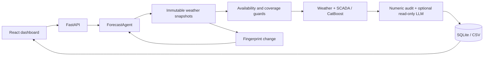

# Low Prior Energy

Low Prior Energy forecasts hourly normalized output from two wind turbines for the next 24–48 hours. A React operations dashboard connects to a FastAPI service and a deterministic forecasting agent: it selects eligible weather snapshots, builds weather/SCADA features, runs per-turbine CatBoost models, validates results, explains them, and recalculates when eligible inputs change. The explorer supports energy-asset types; solar and hydro forecasting are future work.

## Для жюри

**Цикл агента:** получение погоды → проверка доступности и подготовка → модель → почасовой прогноз → проверка и необязательный LLM-анализ → пересчёт при обновлении входов. OpenAI/NVIDIA-аналитик получает только read-only инструменты и никогда не меняет численные прогнозы. Без ключа работает детерминированный анализ.

**Погода действительно входит в модель:** ветер и направление на 100 м, температура на 2 м, календарь, лид и SCADA, доступная на момент выпуска. Параметры выбираются только по ноябрю–декабрю 2025; январь используется для сравнения после фиксации выбора. Все пять моделей оцениваются на одинаковых парах выпуск/цель, с разрезами по турбинам и лидам 1–24 / 25–48. Январь уже использовался в предыдущих экспериментах, поэтому это не новый независимый holdout.

| Модель | Пар | MAE | RMSE |
| --- | ---: | ---: | ---: |
| Константа (медиана) | 2784 | 0.26817 | 0.34506 |
| Климатология (турбина × час) | 2784 | 0.26656 | 0.34237 |
| Persistence | 2784 | 0.33767 | 0.45934 |
| CatBoost SCADA | 2784 | 0.31224 | 0.38933 |
| CatBoost weather-SCADA | 2784 | 0.16181 | 0.23328 |

Метрики — ошибка нормализованной мощности на шкале [0,1], не проценты «точности» и не МВт. Подробные разрезы и результаты фолдов: [отчёт обучения](docs/tuned-training-results.md), [машиночитаемые результаты](docs/model-selection-results.json), экран **Evidence**.

**Главный артефакт:** [февральский CSV](results/february-2026/forecast.csv) и [манифест](results/february-2026/manifest.json): 29 выпусков с 31 января по 28 февраля, две турбины, по 48 часов — **2 784 строки**. Сохранены полные горизонты, включая пограничные цели января и марта. Февральских фактов нет, поэтому февральские MAE/RMSE не заявляются.

**Существенное ограничение:** это реконструкция с реальными погодными модельными данными, **не доказанный архив оперативных прогнозов**. Open-Meteo описывает ранний ECMWF IFS как Cycle 49R1 hindcast. `available_at = run_init + 10h` — явно принятая предпосылка по опубликованному расписанию, а не подтверждение публикации каждого запуска. Строгая часть кейса о фактической доступности в прошлом остаётся открытой. [Источники, пропуски и правила импорта](docs/weather-archive.md).

После установки зависимостей три основные команды:

```sh
npm run reproduce
npm run dev
npm run check
```

Первая воспроизводит подготовку, импорт, выбор модели, январскую оценку, дообучение, февральский replay и регистрацию модели для дашборда. Вторая запускает сайт/API и остаётся работать; третья выполняется в другом терминале. Время полного воспроизведения на этой машине: **485,3 с в чистом клоне (около 8 минут); повтор с готовым кешем — 4,5 с**. Seed = 42, CPU, два потока CatBoost; время зависит от CPU. CSV чистого клона совпал побайтно, повторный запуск не изменил опубликованные файлы. Веса обучаются из исходных файлов, не требуют ручного копирования с компьютера автора.

## Installation and dashboard

Prerequisites: Node.js 22.12+ and [uv](https://docs.astral.sh/uv/). From the repository root:

```sh
uv sync --locked
npm ci
```

Then run the three commands above. Dashboard: **http://127.0.0.1:5173**; API: **http://127.0.0.1:8000**; interactive routes: **http://127.0.0.1:8000/docs**. Vite proxies `/api` and `/health` to the backend. Run `npm run dev:api` / `npm run dev:web` separately when useful.

In **Explore**, select Kazakhstan, the wind site and its turbines, then **Open forecast**. Refresh the workspace after reproduction, select the registered **catboost-weather-scada-v1** model and **Verified archive**, issue **2026-01-31 12:00 UTC**, and choose 24h or 48h. Run the forecast to inspect the chart, weather, provenance, agent events and hourly export. **Run February replay** uses daily 12:00 UTC issues. The model remains marked provisional because the publication and SCADA latency assumptions are not independently confirmed. The archive enum does not establish historical proof: read each snapshot's evidence.

**Evidence** describes the recorded January benchmark, independently of the model currently selected for a forecast. Profile → Appearance offers General, Light and Black. The globe has a keyboard-accessible country/station directory fallback.

An HTTP check while the site is running:

```sh
uv run python scripts/smoke_demo.py
uv run python scripts/smoke_demo.py --archive
```

The second command exercises the reproduced weather model, 29 daily archive forecasts, unchanged-input refresh and CSV export. Both commands create local records; neither estimates February accuracy.

## Reproduction protocol

- Inputs tracked in Git: `data/raw/turbine_1.csv`, `turbine_2.csv`, and `data/weather/ecmwf_ifs_single_runs.csv.gz`.
- Canonical SCADA contains complete hourly intervals only. The source clock is fixed UTC+06:00, timestamps mark interval starts, and availability assumes a 10-minute reporting delay. Missing readings are not zero-filled; invalid rows are quarantined and counted. These source-clock rules differ from current civil time.
- Only **00 UTC ECMWF runs** are used throughout training and replay. Issuing at **12:00 UTC = 17:00 Asia/Almaty** in February 2026 (18:00 on the fixed SCADA clock) uses run leads 13–60. A 10-hour assumed publication delay leaves two hours before issue.
- Training origins start **15 March 2024 at 12:00 UTC**. Missing weather origins are skipped and counted during fitting. Inference and evaluation still require a complete eligible snapshot.
- Three predefined weather configurations compete on chronological November/December folds. January comparison uses cutoff **1 January 2026 00:00 UTC**, issues 1–29 January at noon, and identical targets for all models. Constant/climatology are training-period medians; persistence only reads observations available by each issue.
- The final weather model uses the frozen winning parameters and cutoff **31 January 2026 12:00 UTC**. January metrics do not evaluate these refitted weights. SCADA after its last observation is not synthesized during February.
- Reproduction calls the API's `WindService.execute_backtest` / `ForecastAgent` code, with `weather_source="archive"` and no February actuals. API/worker downloads remain **unverified** until a separate documented import; they are never silently promoted.
- Local caches and model files are ignored. Completed caches are checksum-validated; changed inputs/code create a new experiment revision. The CSV and manifest live in tracked `results/february-2026/`. `npm run reproduce -- --no-register` generates results without publishing into the local API registry.

The offline import explicitly accepts the documented hindcast/schedule assumption. To meet strict historical replay requirements, supply contemporaneous forecasts with original publication evidence and rerun the same workflow. No change to timestamp guards is needed.

## Architecture



| Area | Location |
| --- | --- |
| Dashboard, explorer, Evidence | `frontend/` |
| API, storage, training, evaluation | `backend/wind_backend/` |
| Weather, temporal checks, orchestration, cloud explanations | `agent/wind_agent/` |
| Shared typed contracts | `contracts/wind_contracts/` |
| Generated OpenAPI / TypeScript | `contracts/openapi.json`, `frontend/src/generated/api.ts` |
| One-command reproduction | `scripts/reproduce.py` |
| Reviewable final artifacts | `results/february-2026/`, `docs/model-selection-results.json` |

Original responsibilities for the three teammates are retained in [docs/team-plan.md](docs/team-plan.md).

## API routes

All business routes use `/api/v1`. Full request/response types and examples are in `/docs` and the committed OpenAPI file.

| Method | Route after `/api/v1` | Responsibility / result |
| --- | --- | --- |
| GET | `/assets` | Energy registry with country/site metadata and explicit forecast capability |
| GET | `/turbines` | Configured turbine metadata |
| GET | `/datasets` | Imported dataset metadata |
| POST | `/datasets` | Import validated observations (201) |
| GET | `/datasets/{id}/observations?start=...&end=...` | Observations in an inclusive, timezone-aware window for chart comparison |
| GET | `/models` | Available demo and trained model metadata |
| GET | `/evidence` | Recorded chronological benchmark, comparisons, provenance and limitations |
| GET | `/evidence/export` | Download the same typed evidence report as JSON |
| POST | `/models/train` | Fit baseline using only data available by cutoff (201) |
| GET | `/weather/snapshots?turbine_id=...` | Stored weather and provenance |
| POST | `/weather/fetch` | Download an **unverified** Single Runs candidate (201) |
| POST | `/weather/snapshots` | Import an immutable snapshot/revision (201) |
| GET | `/forecasts?limit=20` | Recent runs, including status and results |
| POST | `/forecasts` | Queue a forecast (202) |
| GET | `/forecasts/{id}` | Poll run status, result, errors, and events |
| GET | `/forecasts/{id}/events` | Agent decision log |
| POST | `/forecasts/{id}/refresh` | Reuse unchanged inputs or queue a new run |
| GET | `/forecasts/{id}/export` | Download hourly CSV with provenance |
| GET | `/backtests` | Replay history |
| POST | `/backtests` | Queue daily rolling replay (202) |
| GET | `/backtests/{id}` | Progress, child runs, metrics, missing actuals |
| GET | `/backtests/{id}/export` | CSV restricted to evaluation target hours |

`GET /health` is outside the versioned prefix. Job lifecycle: `queued → running → succeeded | failed`. Poll every 1–2 seconds; a 202 response means queued, not completed. HTTP errors use `{ "code": "...", "message": "..." }`; job failures use `run.error`. Main error statuses: 404 unknown resource, 409 unavailable archive/immutable record/not-ready export, 422 invalid input, 503 temporary weather transport failure.

## Data integrity and limitations

Every feature observation obeys both `valid_time <= issue_time` and `available_at <= issue_time`. Every fitting label obeys the training cutoff. A model cannot predict an issue before its cutoff. Archive weather must have `run_init <= issue_time`, `available_at <= issue_time`, mandatory evidence, and every requested hourly target. Full model/history checksums, immutable snapshots, fingerprints and refresh remain enforced. Future weather valid times are expected; future publication is rejected.

Power is normalized [0,1]. Rated capacities and hub heights are unknown: no station-MW aggregation, hub-height correction or calibrated uncertainty is claimed. Wind at 100 m is a model covariate, not a turbine measurement. Missing August weather is skipped only in training and reported. Hindcasts and schedule-derived availability prevent an unconditional claim of competition-compliant historical availability. No February ground truth exists in the supplied inputs. Solar/hydro forecasts and unattended scheduling of new issue times remain future work.

Optional cloud explanations: [OpenAI](docs/openai-agent.md) / [NVIDIA](docs/nvidia-agent.md). Credentials stay in local `.env`; never commit them. Configure `WINDFARM_DB`, `WINDFARM_MODELS` and `WINDFARM_TURBINES` consistently for reproduction and the API. No key is needed for the deterministic offline experiment.

## Verification

```sh
npm run contracts
npm run check
```

Commit both generated contract files together. CI checks generated-contract drift. Tests cover late/future observations, model cutoffs, unverified and incomplete weather, snapshot selection, immutable artifacts, shared comparison pairs, frontend flows and the committed February CSV/manifest. `scripts/run_tests.py` uses a repository-local temporary directory to avoid Windows system-temp ACL problems. Component tests do not replace browser/WebGL visual inspection.

### Work from the integrated main branch

Create a feature branch from current `main`, keep commits focused, and open a PR with validation evidence. Check the configured author identity before committing; see [CONTRIBUTING.md](CONTRIBUTING.md). Contract changes include regenerated types and compatible frontend behavior.

## Acceptance checklist

- [x] Weather values are used in the forecasting model.
- [x] Model selection uses chronological November/December folds only.
- [x] January comparison includes constant, climatology, persistence and both CatBoost feature sets on identical pairs.
- [x] February forecast CSV and provenance manifest are committed; no synthetic weather is used.
- [x] Missing training weather is counted; inference remains strict.
- [x] Single-command reproduction restores model weights and the dashboard registry from a clean clone.
- [x] Agent validates, predicts, analyses and recomputes when eligible inputs change.
- [ ] Historical publication of every exact weather forecast is independently proven (hindcast limitation).
- [ ] Observation latency, rated capacities and hub heights are independently confirmed.
- [ ] February accuracy is measured against supplied actuals (actuals unavailable).

See [the judge walkthrough](docs/judges-walkthrough.md) and [the original case](docs/task.pdf).
