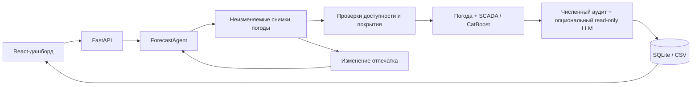

# Low Prior Energy

Low Prior Energy прогнозирует почасовую нормализованную мощность двух ветротурбин на 24–48 часов вперёд. React-дашборд операционного управления подключается к сервису FastAPI и детерминированному агенту прогнозирования: он отбирает подходящие снимки погоды, строит погодные/SCADA-признаки, запускает CatBoost-модели по каждой турбине, проверяет результаты, объясняет их и пересчитывает прогноз при изменении входных данных. Проводник (explorer) поддерживает разные типы энергоактивов; солнечная и гидроэнергетика — задачи на будущее.

## Для жюри

**Цикл агента:** получение погоды → проверка доступности и подготовка → модель → почасовой прогноз → проверка и необязательный LLM-анализ → пересчёт при обновлении входов. OpenAI/NVIDIA-аналитик получает только read-only инструменты и никогда не меняет численные прогнозы. Без ключа работает детерминированный анализ.

**Погода действительно входит в модель:** ветер и направление на 100 м, температура на 2 м, календарь, лид и SCADA, доступная на момент выпуска. Параметры выбираются только по ноябрю–декабрю 2025; январь используется для сравнения после фиксации выбора. Все пять моделей оцениваются на одинаковых парах выпуск/цель, с разрезами по турбинам и лидам 1–24 / 25–48. Январь уже использовался в предыдущих экспериментах, поэтому это не новый независимый holdout.

| Модель | Пар | MAE | RMSE |
| --- | ---: | ---: | ---: |
| Константа (медиана) | 2784 | 0.26817 | 0.34506 |
| Климатология (турбина × час) | 2784 | 0.26656 | 0.34237 |
| Persistence | 2784 | 0.33767 | 0.45934 |
| CatBoost SCADA | 2784 | 0.31224 | 0.38933 |
| CatBoost weather-SCADA | 2784 | 0.16181 | 0.23328 |

Метрики — ошибка нормализованной мощности на шкале [0,1], не проценты «точности» и не МВт. Подробные разрезы и результаты фолдов: [отчёт обучения](docs/tuned-training-results.md), [машиночитаемые результаты](docs/model-selection-results.json), экран **Evidence**.

**Главный артефакт:** [февральский CSV](results/february-2026/forecast.csv) и [манифест](results/february-2026/manifest.json): 29 выпусков с 31 января по 28 февраля, две турбины, по 48 часов — **2 784 строки**. Сохранены полные горизонты, включая пограничные цели января и марта. Февральских фактов нет, поэтому февральские MAE/RMSE не заявляются.

**Существенное ограничение:** это реконструкция с реальными погодными модельными данными, **не доказанный архив оперативных прогнозов**. Open-Meteo описывает ранний ECMWF IFS как Cycle 49R1 hindcast. `available_at = run_init + 10h` — явно принятая предпосылка по опубликованному расписанию, а не подтверждение публикации каждого запуска. Строгая часть кейса о фактической доступности в прошлом остаётся открытой. [Источники, пропуски и правила импорта](docs/weather-archive.md).

После установки зависимостей три основные команды:

```sh
npm run reproduce
npm run dev
npm run check
```

Первая воспроизводит подготовку, импорт, выбор модели, январскую оценку, дообучение, февральский replay и регистрацию модели для дашборда. Вторая запускает сайт/API и остаётся работать; третья выполняется в другом терминале. Время полного воспроизведения на этой машине: **485,3 с в чистом клоне (около 8 минут); повтор с готовым кешем — 4,5 с**. Seed = 42, CPU, два потока CatBoost; время зависит от CPU. CSV чистого клона совпал побайтно, повторный запуск не изменил опубликованные файлы. Веса обучаются из исходных файлов, не требуют ручного копирования с компьютера автора.

## Установка и дашборд

Требования: Node.js 22.12+ и [uv](https://docs.astral.sh/uv/). Из корня репозитория:

```sh
uv sync --locked
npm ci
```

Затем выполните три команды выше. Дашборд: **http://127.0.0.1:5173**; API: **http://127.0.0.1:8000**; интерактивные маршруты: **http://127.0.0.1:8000/docs**. Vite проксирует `/api` и `/health` на бэкенд. При необходимости запускайте `npm run dev:api` / `npm run dev:web` отдельно.

В **Explore** выберите Казахстан, ветровую площадку и её турбины, затем нажмите **Open forecast**. После воспроизведения обновите рабочую область, выберите зарегистрированную модель **catboost-weather-scada-v1** и **Verified archive**, укажите выпуск **2026-01-31 12:00 UTC** и выберите 24 или 48 часов. Запустите прогноз, чтобы посмотреть график, погоду, происхождение данных (provenance), события агента и почасовой экспорт. **Run February replay** использует ежедневные выпуски в 12:00 UTC. Модель остаётся помеченной как предварительная (provisional), поскольку предпосылки о задержке публикации и SCADA независимо не подтверждены. Перечисление архива само по себе не доказывает историческую достоверность: смотрите доказательства по каждому снимку.

**Evidence** описывает зафиксированный январский бенчмарк независимо от модели, выбранной в данный момент для прогноза. Profile → Appearance предлагает General, Light и Black. У глобуса есть доступный с клавиатуры резервный справочник стран/станций.

HTTP-проверка при запущенном сайте:

```sh
uv run python scripts/smoke_demo.py
uv run python scripts/smoke_demo.py --archive
```

Вторая команда задействует воспроизведённую погодную модель, 29 ежедневных архивных прогнозов, обновление при неизменных входах и экспорт CSV. Обе команды создают локальные записи; ни одна не оценивает точность за февраль.

## Протокол воспроизведения

- Входные данные под контролем Git: `data/raw/turbine_1.csv`, `turbine_2.csv` и `data/weather/ecmwf_ifs_single_runs.csv.gz`.
- Канонический SCADA содержит только полные почасовые интервалы. Исходные часы зафиксированы как UTC+06:00, метки времени обозначают начало интервала, доступность предполагает задержку отчётности 10 минут. Пропущенные показания не заполняются нулями; невалидные строки помещаются в карантин и подсчитываются. Эти правила исходных часов отличаются от текущего гражданского времени.
- Во всём обучении и replay используются только запуски **ECMWF 00 UTC**. Выпуск в **12:00 UTC = 17:00 Asia/Almaty** в феврале 2026 (18:00 по зафиксированным часам SCADA) использует лиды запуска 13–60. Предполагаемая 10-часовая задержка публикации оставляет два часа до выпуска.
- Отсчёт обучающих периодов начинается **15 марта 2024, 12:00 UTC**. Пропущенные погодные периоды пропускаются и подсчитываются при обучении. Инференс и оценка по-прежнему требуют полного подходящего снимка.
- Три заранее заданные погодные конфигурации соревнуются на хронологических ноябрьско-декабрьских фолдах. Январское сравнение использует отсечку **1 января 2026, 00:00 UTC**, выпуски с 1 по 29 января в полдень и одинаковые цели для всех моделей. Константа/климатология — медианы за период обучения; persistence читает только наблюдения, доступные на момент каждого выпуска.
- Финальная погодная модель использует зафиксированные победившие параметры и отсечку **31 января 2026, 12:00 UTC**. Январские метрики не оценивают эти дообученные веса. SCADA после последнего наблюдения не синтезируется в феврале.
- Воспроизведение вызывает код `WindService.execute_backtest` / `ForecastAgent` API с `weather_source="archive"` и без февральских фактов. Загрузки API/воркера остаются **неподтверждёнными** до отдельного документированного импорта; они никогда не продвигаются автоматически.
- Локальные кеши и файлы моделей игнорируются. Завершённые кеши проходят проверку контрольных сумм; изменённые входные данные/код создают новую ревизию эксперимента. CSV и манифест лежат в отслеживаемой папке `results/february-2026/`. `npm run reproduce -- --no-register` генерирует результаты без публикации в локальный реестр API.

Офлайн-импорт явно принимает документированную предпосылку hindcast/расписания. Чтобы удовлетворить строгим требованиям исторического replay, предоставьте современные прогнозы с оригинальными доказательствами публикации и повторите тот же процесс. Изменения в проверках меток времени не требуются.

## Архитектура



| Область | Расположение |
| --- | --- |
| Дашборд, проводник, Evidence | `frontend/` |
| API, хранилище, обучение, оценка | `backend/wind_backend/` |
| Погода, проверки времени, оркестрация, облачные объяснения | `agent/wind_agent/` |
| Общие типизированные контракты | `contracts/wind_contracts/` |
| Сгенерированные OpenAPI / TypeScript | `contracts/openapi.json`, `frontend/src/generated/api.ts` |
| Воспроизведение одной командой | `scripts/reproduce.py` |
| Итоговые артефакты для проверки | `results/february-2026/`, `docs/model-selection-results.json` |

Исходное распределение обязанностей между тремя участниками команды сохранено в [docs/team-plan.md](docs/team-plan.md).

## Маршруты API

Все бизнес-маршруты используют `/api/v1`. Полные типы запросов/ответов и примеры — в `/docs` и закоммиченном файле OpenAPI.

| Метод | Маршрут после `/api/v1` | Назначение / результат |
| --- | --- | --- |
| GET | `/assets` | Реестр энергоактивов с метаданными страны/площадки и явной возможностью прогноза |
| GET | `/turbines` | Метаданные настроенных турбин |
| GET | `/datasets` | Метаданные импортированных наборов данных |
| POST | `/datasets` | Импорт валидированных наблюдений (201) |
| GET | `/datasets/{id}/observations?start=...&end=...` | Наблюдения во включительном, учитывающем часовой пояс окне для сравнения на графике |
| GET | `/models` | Метаданные доступных демо- и обученных моделей |
| GET | `/evidence` | Зафиксированный хронологический бенчмарк, сравнения, происхождение данных и ограничения |
| GET | `/evidence/export` | Скачать тот же типизированный отчёт evidence в JSON |
| POST | `/models/train` | Обучить базовую модель, используя только данные, доступные на момент отсечки (201) |
| GET | `/weather/snapshots?turbine_id=...` | Сохранённая погода и происхождение данных |
| POST | `/weather/fetch` | Загрузить **неподтверждённого** кандидата Single Runs (201) |
| POST | `/weather/snapshots` | Импорт неизменяемого снимка/ревизии (201) |
| GET | `/forecasts?limit=20` | Последние запуски, включая статус и результаты |
| POST | `/forecasts` | Поставить прогноз в очередь (202) |
| GET | `/forecasts/{id}` | Опрос статуса запуска, результата, ошибок и событий |
| GET | `/forecasts/{id}/events` | Журнал решений агента |
| POST | `/forecasts/{id}/refresh` | Переиспользовать неизменённые входы или поставить новый запуск |
| GET | `/forecasts/{id}/export` | Скачать почасовой CSV с происхождением данных |
| GET | `/backtests` | История replay |
| POST | `/backtests` | Поставить в очередь ежедневный скользящий replay (202) |
| GET | `/backtests/{id}` | Прогресс, дочерние запуски, метрики, отсутствующие факты |
| GET | `/backtests/{id}/export` | CSV, ограниченный целевыми часами оценки |

`GET /health` находится вне версионированного префикса. Жизненный цикл задачи: `queued → running → succeeded | failed`. Опрашивайте каждые 1–2 секунды; ответ 202 означает «в очереди», а не «завершено». Ошибки HTTP используют `{ "code": "...", "message": "..." }`; сбои задач — `run.error`. Основные статусы ошибок: 404 неизвестный ресурс, 409 недоступный архив/неизменяемая запись/экспорт не готов, 422 неверные входные данные, 503 временный сбой транспорта погодных данных.

## Целостность данных и ограничения

Каждое признаковое наблюдение подчиняется и `valid_time <= issue_time`, и `available_at <= issue_time`. Каждая обучающая метка подчиняется отсечке обучения. Модель не может прогнозировать выпуск раньше своей отсечки. Архивная погода должна иметь `run_init <= issue_time`, `available_at <= issue_time`, обязательное доказательство и каждую запрошенную почасовую цель. Полные контрольные суммы модели/истории, неизменяемые снимки, отпечатки и обновление по-прежнему обеспечиваются принудительно. Будущие валидные времена погоды ожидаемы; будущая публикация отклоняется.

Мощность нормализована в диапазоне [0,1]. Номинальные мощности и высоты ступиц неизвестны: агрегация по станциям в МВт, коррекция по высоте ступицы или калиброванная неопределённость не заявляются. Ветер на 100 м — ковариата модели, а не измерение турбины. Пропуски августовской погоды пропускаются только при обучении и фиксируются. Hindcast-данные и доступность, выведенная из расписания, не позволяют безусловно утверждать соответствие исторической доступности требованиям соревнования. Февральских фактических данных во входных данных нет. Прогнозы солнечной/гидроэнергетики и автоматизированное планирование новых моментов выпуска остаются задачами на будущее.

Опциональные облачные объяснения: [OpenAI](docs/openai-agent.md) / [NVIDIA](docs/nvidia-agent.md). Учётные данные хранятся в локальном `.env`; никогда не коммитьте их. Настройте `WINDFARM_DB`, `WINDFARM_MODELS` и `WINDFARM_TURBINES` согласованно для воспроизведения и API. Для детерминированного офлайн-эксперимента ключ не нужен.

## Проверка

```sh
npm run contracts
npm run check
```

Коммитьте оба сгенерированных файла контрактов вместе. CI проверяет расхождение сгенерированных контрактов. Тесты покрывают поздние/будущие наблюдения, отсечки моделей, неподтверждённую и неполную погоду, выбор снимков, неизменяемые артефакты, общие пары сравнения, フронтенд-сценарии и закоммиченные февральские CSV/манифест. `scripts/run_tests.py` использует локальную для репозитория временную директорию, чтобы избежать проблем с ACL системного temp в Windows. Компонентные тесты не заменяют визуальную проверку в браузере/WebGL.

### Работа из интегрированной ветки main

Создайте фиче-ветку от текущей `main`, делайте коммиты сфокусированными и открывайте PR с доказательствами валидации. Проверьте настроенную идентичность автора перед коммитом; см. [CONTRIBUTING.md](CONTRIBUTING.md). Изменения контрактов включают регенерированные типы и совместимое поведение фронтенда.

## Чек-лист приёмки

- [x] Значения погоды используются в модели прогнозирования.
- [x] Выбор модели использует только хронологические ноябрьско-декабрьские фолды.
- [x] Январское сравнение включает константу, климатологию, persistence и оба набора признаков CatBoost на одинаковых парах.
- [x] Февральский CSV прогноза и манифест происхождения данных закоммичены; синтетическая погода не используется.
- [x] Пропущенная обучающая погода подсчитывается; инференс остаётся строгим.
- [x] Воспроизведение одной командой восстанавливает веса модели и реестр дашборда из чистого клона.
- [x] Агент проверяет, прогнозирует, анализирует и пересчитывает при изменении подходящих входов.
- [ ] Историческая публикация каждого точного погодного прогноза независимо доказана (ограничение hindcast).
- [ ] Задержка наблюдений, номинальные мощности и высоты ступиц независимо подтверждены.
- [ ] Февральская точность измерена по предоставленным фактическим данным (факты недоступны).

См. [обзор для жюри](docs/judges-walkthrough.md) и [исходный кейс](docs/task.pdf).