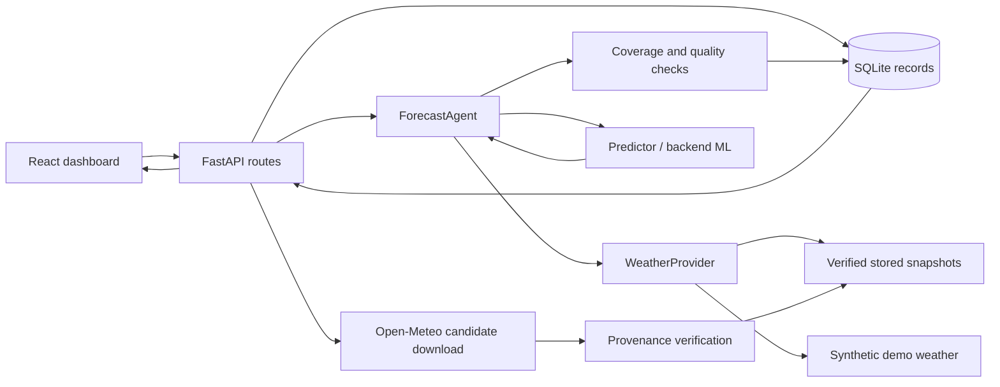

# Low Prior Wind

> Historical implementation brief from `danik`, retained as context. Current startup commands, API contracts, implemented features and remaining work are maintained in the root [README](../README.md). This snapshot does not override the integrated documentation.

An agent-driven workspace for forecasting hourly output from **two wind turbines, 24–48 hours ahead**. This repository is the shared starting point for the `Agent`, `backend`, and `frontend` branches. Solar and hydro are outside the current scope.

The skeleton runs end to end today with **clearly labelled synthetic weather**. It includes a real API, React dashboard, SQLite persistence, baseline model training, auditable weather snapshots, daily replay, CSV export, and tests. It does **not** claim a trained competition model or verified February weather coverage.

## 1. Start here

Prerequisites: [Node.js](https://nodejs.org/) 22.12+ and [uv](https://docs.astral.sh/uv/getting-started/installation/). uv installs the Python version in `.python-version` if necessary. Run all commands from the repository root.

```sh
uv sync --locked
npm ci
npm run dev
```

| Service | Address |
| --- | --- |
| Dashboard | http://127.0.0.1:5173 |
| API | http://127.0.0.1:8000 |
| Interactive API documentation | http://127.0.0.1:8000/docs |
| OpenAPI schema | http://127.0.0.1:8000/openapi.json |
| Health check | http://127.0.0.1:8000/health |

Keep `npm run dev` running. Select the turbines, leave **Synthetic demo** and **Demo power curve** selected, and click **Run forecast**. The dashboard displays hourly values, the agent's decisions, and a CSV download. **Run daily replay** generates the February demonstration; accuracy remains unavailable without actual observations.

Run separately when working in one area:

```sh
npm run dev:api
npm run dev:web
```

The backend owns port **8000**; Vite owns **5173** and proxies `/api` and `/health`. The agent is an importable Python module inside the API process, so it needs no third HTTP service. The frontend uses relative API URLs, without credentials or browser-to-weather calls.

Configuration is optional for the demo. Copy `.env.example` to `.env` to change database/config paths. Real turbine coordinates, capacity, hub height, and source timezone are **not known yet**. Copy `config/turbines.example.json` to `config/turbines.local.json`, fill confirmed values, and set `WINDFARM_TURBINES=config/turbines.local.json`. Never invent coordinates from a nearby town.

## 2. Three people, three areas

### Person 1 — Agent / weather / orchestration (`Agent` branch)

**Own:** `agent/`, `tests/test_leakage.py`, `tests/test_weather_adapter.py`, `docs/agent.md`.

**Already provided:** `ForecastAgent`, weather/predictor protocols, deterministic demo weather, verified-archive selection, a Single Runs download adapter, bounded retries, input fingerprints, decision events, and an optional refresh watcher.

**Your tasks, in order:**

1. Confirm both coordinates and investigate original forecast coverage for January–February 2026. Record the source, original model run, publication evidence, units, and wind height.
2. Download candidate weather through `/weather/fetch`; verify provenance before importing a separate verified snapshot. A current download timestamp is not historical publication evidence.
3. Complete weather preparation: choose a suitable model/height, handle missing hours explicitly, cache raw provider responses, and document any correction or interpolation.
4. Improve the agent's decisions: choose permitted fallback runs, explain failures, monitor new inputs, and recompute when the fingerprint changes.
5. Add an optional LLM planner only if it improves decisions. The current implementation is a **policy-driven workflow**, with no LLM integration. Keep data-availability checks outside any LLM's control.

**Deliver to backend:** a `WeatherProvider` returning `WeatherSnapshot`; `ForecastAgent.run(request, turbines, emit)` returns `ForecastResult`. Import only `wind_contracts`, your own code, and third-party libraries. Do not import backend implementation modules.

**Done when:** both turbines have evidence-backed forecast snapshots, replay cannot see future weather, failures/retries are logged, changed inputs produce a new run, and your tests pass.

### Person 2 — Backend / ML / evaluation (`backend` branch)

**Own:** `backend/`, `tests/test_api.py`, `tests/test_ml.py`, data adapters in `scripts/`, `docs/backend.md`.

**Steward shared integration files:** `contracts/`, `config/`, `pyproject.toml`, `uv.lock`, root scripts and CI. Discuss breaking contract changes with the other two people in the PR; no separate permission process is required.

**Already provided:** versioned FastAPI routes, validated schemas, SQLite storage, dataset import, a trainable binned power-curve baseline, an illustrative demo model, forecast/backtest jobs, horizon-specific MAE/RMSE, exports, and restart recovery.

**Your tasks, in order:**

1. Obtain the supplied March 2023–January 2026 data. Confirm source columns, timestamp semantics, timezone changes, turbine IDs, and normalization. Convert it to the canonical observation contract.
2. Analyse missing values, curtailment/stoppages, invalid readings, and target distribution. Fit transformations on training data only.
3. Implement a persistence baseline and a candidate ML model behind `Predictor`. The included binned curve is a starting baseline, not a validated final solution.
4. Join archived weather to targets by **issue time + valid time + turbine**, not just timestamp. Add forecast lead, weather variables, and only those SCADA features available at issue time.
5. Use chronological pre-February validation. Freeze model selection before scoring February. Add calibrated uncertainty only after checking coverage.
6. Produce February CSVs and a metrics report, separately for 1–24 and 25–48 hours and each turbine. Add station-level aggregation when rated capacities and normalization are confirmed.

**Deliver to agent:** a `Predictor` with `.info` and `.predict(turbine, weather, issued_at) -> list[ForecastPoint]`. **Deliver to frontend:** the API in section 4 and generated types. Keep ML independent of HTTP.

**Done when:** training is reproducible, model metadata records cutoff/data/version, no feature uses future observations, replay metrics beat or honestly compare with baselines, and API tests pass.

### Person 3 — Frontend / demonstration (`frontend` branch)

**Own:** `frontend/` except generated contracts, `docs/frontend.md`; update the npm lockfile when dependencies change.

**Already provided:** React + TypeScript + Vite, typed API client, turbine selection, 24/48-hour controls, normalized-power chart and table, asynchronous job polling, errors, provenance, decision log, history, replay, and CSV downloads.

**Your tasks, in order:**

1. Refine the dashboard and add a map once coordinates are confirmed.
2. Build dataset upload/training controls on the existing routes; add a selector for actual observations in replay. Until then, use Swagger or the CSV helper.
3. Display forecast versus actual power, per-horizon metrics, and missing-data coverage. Show uncertainty only when supplied by a calibrated backend model.
4. Make archive verification status and original issue times visible. Keep demo results clearly labelled.
5. Polish loading, empty, error, keyboard, and mobile states; prepare a short demonstration of the full workflow.

**Integration rule:** all calls go through `frontend/src/api.ts`. Import generated types from `frontend/src/generated/api.ts`; do not recreate response shapes or calculate power predictions in the browser.

**Done when:** users can launch and inspect a forecast/replay, errors are understandable, the UI shows real API data and correct units, and `npm run build` passes.

## 3. Architecture and folder boundaries

```text
frontend/                        Person 3: React dashboard + API client
backend/wind_backend/
  main.py                        Person 2: application and error handling
  routes.py                      Person 2: all public HTTP routes
  service.py                     Person 2: integration + forecast/replay jobs
  storage.py                     Person 2: persistent SQLite repository
  ml.py                          Person 2: interchangeable prediction models
  evaluation.py                  Person 2: metrics by turbine and horizon
agent/wind_agent/
  interfaces.py                  Person 1: weather and predictor interfaces
  weather.py                     Person 1: demo/archive/Open-Meteo adapters
  orchestrator.py                Person 1: validate → fetch → predict → analyse
  worker.py                      Person 1: optional input-refresh watcher
contracts/wind_contracts/        Shared Pydantic request/response contracts
contracts/openapi.json          Generated API contract; committed
frontend/src/generated/api.ts   Generated TypeScript contract; committed
config/                         Confirmed asset configuration
examples/                       Small artificial development inputs
scripts/                        Import, schema generation, smoke demonstration
tests/                          API integration + leakage + model checks
docs/                           Detailed implementation agreements
data/                           Local observations/weather/database; ignored
artifacts/                      Local model/report outputs; ignored
```



## 4. Predefined API routes

All business routes use `/api/v1`. Full request/response types and examples are in `/docs` and the committed OpenAPI file.

| Method | Route after `/api/v1` | Responsibility / result |
| --- | --- | --- |
| GET | `/turbines` | Configured turbine metadata |
| GET | `/datasets` | Imported dataset metadata |
| POST | `/datasets` | Import validated observations (201) |
| GET | `/models` | Available demo and trained model metadata |
| POST | `/models/train` | Fit baseline using only data available by cutoff (201) |
| GET | `/weather/snapshots?turbine_id=...` | Stored weather and provenance |
| POST | `/weather/fetch` | Download an **unverified** Single Runs candidate (201) |
| POST | `/weather/snapshots` | Import an immutable snapshot/revision (201) |
| GET | `/forecasts?limit=20` | Recent runs, including status and results |
| POST | `/forecasts` | Queue a forecast (202) |
| GET | `/forecasts/{id}` | Poll run status, result, errors, and events |
| GET | `/forecasts/{id}/events` | Agent decision log |
| POST | `/forecasts/{id}/refresh` | Reuse unchanged inputs or queue a new run |
| GET | `/forecasts/{id}/export` | Download hourly CSV with provenance |
| GET | `/backtests` | Replay history |
| POST | `/backtests` | Queue daily rolling replay (202) |
| GET | `/backtests/{id}` | Progress, child runs, metrics, missing actuals |
| GET | `/backtests/{id}/export` | CSV restricted to evaluation target hours |

`GET /health` is outside the versioned prefix. Job lifecycle: `queued → running → succeeded | failed`. Poll every 1–2 seconds; a 202 response means queued, not completed. HTTP errors use `{ "code": "...", "message": "..." }`; job failures use `run.error`. Main error statuses: 404 unknown resource, 409 unavailable archive/immutable record/not-ready export, 422 invalid input, 503 temporary weather transport failure.

Example forecast request:

```json
{
  "turbine_ids": ["turbine-1", "turbine-2"],
  "issued_at": "2026-01-31T00:00:00Z",
  "horizon_hours": 48,
  "weather_source": "demo",
  "model_id": "demo-power-curve"
}
```

## 5. Shared data rules — agree before implementing

- **UTC internally, explicit timezone required.** Naive timestamps are rejected. Convert the source dataset with its confirmed timezone rules; do not apply a guessed constant offset across 2023–2026.
- **Target timing:** points are timestamped hourly interval ends. A run issued at `T` predicts `T+1h … T+48h`; the point at `T+1h` represents mean power during `(T, T+1h]`. The starter uses weather at that valid timestamp as its feature. The backend owner must align organizer data and radiation/accumulation-style variables appropriately if added later.
- **Power:** the initial contract expects a capacity fraction in `[0,1]`. Confirm the supplied normalization before conversion. Do not silently clip or call arbitrary normalized values MW. No physical capacity is assumed.
- **Weather:** wind in **m/s**, temperature in **°C**, direction in **degrees**; each snapshot records wind height. The current external adapter requests 100 m wind, which is not automatically hub height.
- **Availability:** `run_init` is model initialization; `available_at` is when the output was actually accessible; `retrieved_at` is today's download time. These are different fields. Valid weather times are expected to be in the future; publication time must be at or before issue time.
- **Replay:** require `verification=verified`, nonempty evidence, `available_at <= issued_at`, and complete hourly coverage. No reanalysis/observations or synthetic fallback is permitted in archive mode.
- **ML:** training uses only rows with both `valid_time <= trained_through` and `available_at <= trained_through`; a model cannot be used before its training cutoff. Feature/preprocessing leakage still needs checks when replacing the baseline.
- **Immutability:** preserve previous forecasts. New input content produces a new run; identical content reuses the previous result. Imported weather IDs cannot be overwritten; verify a candidate by importing a new revision with a new ID.
- **Evaluation:** preserve overlapping predictions as separate issue/lead pairs. February evaluation filters target timestamps, not issue timestamps. Actuals are read only after forecasts are made. Missing actuals count as unscored, never as zero production.

The UI's replay dates use UTC to demonstrate the mechanism. Confirm the competition's daily issue time and definition of “February” in the station timezone before final evaluation. Configure the API request accordingly; do not assume the UI preset is the final evaluation protocol.

## 6. Train a first baseline

`examples/observations.demo.csv` contains **artificial development rows only**. Import it while the API is running:

```sh
uv run python scripts/import_csv.py examples/observations.demo.csv --name artificial-training-example --demo
```

The `--demo` flag keeps models trained on artificial data labelled as demo even with archived weather. Copy the returned dataset ID into `POST /api/v1/models/train` in Swagger:

```json
{
  "dataset_id": "dataset-REPLACE_WITH_RETURNED_ID",
  "trained_through": "2026-01-30T23:00:00Z"
}
```

Refresh the dashboard's recent-runs list to reload the model selector, or use the returned model ID in a forecast request. Training on this small example only verifies integration. Real accuracy requires the supplied data, a proper validation split, and archived forecast features.

The CSV contract is:

```text
turbine_id,valid_time,available_at,wind_speed_ms,temperature_c,power_normalized
```

Native source column names must be mapped explicitly by the backend owner. `available_at` must reflect known observation latency; the example's zero latency is artificial. Do not upload private/raw datasets to Git.

## 7. Weather archive and agent workflow

The adapter is implemented but has only been tested against mocked provider responses. Real coordinates and genuine archive coverage must be verified by the Agent owner.

1. Configure real coordinates.
2. Call `/weather/fetch` with `turbine_id`, `run_init`, and `weather_model="ecmwf_ifs"`.
3. Inspect the source and archive lineage. A downloaded candidate remains `unverified`, with no assumed `available_at`.
4. Once independently supported, import a **new snapshot ID** with `verification="verified"`, the historically correct `available_at`, and `availability_evidence` identifying the original source/publication record. This field records a review decision; the skeleton does not independently authenticate that claim.
5. Run with `weather_source="archive"` and a trained model. Review warnings and export provenance.

Open-Meteo's [Historical Forecast API](https://open-meteo.com/en/docs/historical-forecast-api) stitches initial hours from successive runs. Its [Single Runs API](https://open-meteo.com/en/docs/single-runs-api) exposes initialization-specific forecasts; current documentation describes early ECMWF coverage as hindcasts, and most other models start in April 2026. **Do not assume any historical-looking response satisfies the February availability rule.** Confirm original forecast provenance and publication delay. Free hosted access is for noncommercial use with rate limits; provide source attribution ([pricing](https://open-meteo.com/en/pricing)).

An optional watcher checks an existing successful run for newly imported eligible weather:

```sh
uv run python -m wind_agent.worker --run-id run-REPLACE --interval 60
```

It polls input changes and follows the new run ID after recomputation. It does not download weather, advance issue time, or retrain models. New daily forecasts and automated verified ingestion are Agent-owner follow-up tasks.

## 8. Contracts, tests, and integration

```sh
npm run contracts
npm run check
```

`contracts` exports OpenAPI from the backend and regenerates TypeScript. Commit both generated files whenever the API changes. Do not hand-edit them. `check` runs Python lint, tests, TypeScript checks, and the frontend production build. CI repeats these checks and fails on generated-contract drift.

With `npm run dev` running, exercise the HTTP services through the frontend proxy:

```sh
uv run python scripts/smoke_demo.py
```

This creates labelled local demo records, checks a 48-hour forecast and unchanged-input refresh, and completes all 29 daily issue dates with February CSV export. It checks integration, not predictive accuracy.

Tests cover real integration boundaries: full demo flow, persistent results and CSVs, hourly coverage, invalid units/times, late or unverified weather, model cutoffs, observation latency, retries, immutable snapshots, changed-input refresh, and replay scoring. No live network is needed for tests.

### Put the common foundation into all three branches

The three branches originally point at the same initial commit. First review and commit this skeleton on `main`, then each teammate brings that foundation into their own branch. Example commands for the person integrating the foundation:

```sh
git switch main
git add .
git commit -m "Add shared wind forecasting skeleton"
git push origin main
```

Each teammate then runs the following, replacing `Agent` with their exact branch name (`Agent`, `backend`, or `frontend`):

```sh
git fetch origin
git switch Agent
git merge origin/main
git push -u origin Agent
```

For normal integration, open a PR to `main`, include route/contract changes and test evidence, merge after checks, then update the other branches from `main`. Integrate in small working slices: **contracts → weather/model implementation → dashboard features → complete replay**. Everyone can work immediately using the demo provider/model; no teammate has to wait for the final ML model.

### Final team acceptance checklist

- [ ] Source data normalization, time interval semantics, timezone, and asset metadata confirmed.
- [ ] Archived forecast coverage and publication evidence verified for every issue date.
- [ ] Trained model and preprocessing validated chronologically before February.
- [ ] Agent completes acquisition, preparation, inference, analysis, and input-triggered updates.
- [ ] February replay has correct windows, no future inputs, and no hidden demo results.
- [ ] Metrics include baseline comparison, both horizons, missing-data coverage, and per-turbine results.
- [ ] Fresh clone starts using the README; schemas, lockfiles, tests, and UI build pass.
- [ ] Demo and limitations are explained honestly in the presentation.

## 9. Current limits

This is a local development skeleton: one API process, in-process background jobs, small SQLite JSON records, no authentication, and no production task queue. A restart marks unfinished jobs failed. Run one worker; multiple API workers would need a shared queue and coordinated job ownership. Large datasets/training jobs, paginated results, production deployment, calibrated uncertainty, scheduled ingestion, and a competitive ML model are remaining engineering work. The static frontend build needs an HTTP host/reverse proxy routing `/api` to the backend; Vite's development proxy is not a production deployment.

Detailed handoffs: [Agent](docs/agent.md) · [Backend/ML](docs/backend.md) · [Frontend](docs/frontend.md) · [Data and replay](docs/data-and-replay.md).
